# Fake-Review Detection — LLM Judge Evaluation Report

Read every accuracy against its dataset's **majority-class floor** (dashed line in the plots, last columns of the tables) and every RAG number against the **retrieval-only k-NN baseline**: on the unsampled datasets a model scores 0.667–0.773 by always answering "fake", and on the synthetic datasets retrieval alone is near ceiling.

## 1. Data & methodology

**Modalities.**

- `zeroshot` — direct classification with the RAG prompt minus the retrieved examples. The control condition; the RAG/zero-shot gap is retrieval's contribution and nothing else.

- `rag` — retrieval-augmented classification (k=5 FAISS neighbours from the train split), plus a `retrieval-only` row that is the majority label of those neighbours with no LLM involved.

- `bert` — the fine-tuned baseline's own per-row predictions.

- `classical` — SVM and XGBoost, metrics only: those trainers never wrote per-row predictions, so they appear in the tables but not in the confusion matrices or the agreement analysis.

**Label convention.** `fake` is the positive class (1); `real` is the negative class (0). Precision/recall/F1 are for `fake`.

**Failure handling.** A `pred_label` that is neither `real` nor `fake` (an UNKNOWN, or a dead call) is a failure: excluded from every metric and counted in its own column. The classifiers report it as `unknown_predictions` for the same reason.

**Splits.** Test halves come from each dataset's seeded 75/25 `split` column, so every classifier here scores the same rows per dataset.

### Datasets

| dataset | test n | floor | human real | human fake | synthetic |
|---|---|---|---|---|---|
| `d1_human_real_vs_human_fake` | 398 | 0.500 | 199 | 199 | 0 |
| `d2_sampled_human_real_vs_synthetic` | 398 | 0.500 | 199 | 0 | 199 |
| `d2.5_sampled_human_real_vs_synthetic` | 398 | 0.500 | 199 | 0 | 199 |
| `d3_sampled_human_real_vs_mixed` | 398 | 0.500 | 199 | 99 | 100 |
| `d3.5_sampled_human_real_vs_mixed` | 398 | 0.500 | 199 | 99 | 100 |
| `d3_unsampled_human_real_vs_mixed` | 598 | 0.667 | 199 | 199 | 200 |
| `d2.5_unsampled_human_real_vs_synthetic` | 679 | 0.707 | 199 | 0 | 480 |
| `d3.5_unsampled_human_real_vs_mixed` | 878 | 0.773 | 199 | 199 | 480 |

### Models per modality

| modality | models |
|---|---|
| zeroshot | `gemma4-it-31b` (8 datasets), `muse-glimmer-30b` (8 datasets), `nemotron` (8 datasets), `qwen3.8-27b` (8 datasets) |
| rag | `gemma4-it-31b` (8 datasets), `muse-glimmer-30b` (8 datasets), `nemotron` (8 datasets), `qwen-3.8:27b` (8 datasets), `qwen3.8-27b` (8 datasets), `retrieval-only 5-NN` (8 datasets) |
| bert | `bert` (8 datasets) |
| classical | `svm`, `xgboost` |

## 2. Failure rate

| modality | model | dataset | total | failures | failure rate | valid |
|---|---|---|---|---|---|---|
| bert | `bert` | `d1_human_real_vs_human_fake` | 398 | 0 | 0.00% | 398 |
| bert | `bert` | `d2.5_sampled_human_real_vs_synthetic` | 398 | 0 | 0.00% | 398 |
| bert | `bert` | `d2.5_unsampled_human_real_vs_synthetic` | 679 | 0 | 0.00% | 679 |
| bert | `bert` | `d2_sampled_human_real_vs_synthetic` | 398 | 0 | 0.00% | 398 |
| bert | `bert` | `d3.5_sampled_human_real_vs_mixed` | 398 | 0 | 0.00% | 398 |
| bert | `bert` | `d3.5_unsampled_human_real_vs_mixed` | 878 | 0 | 0.00% | 878 |
| bert | `bert` | `d3_sampled_human_real_vs_mixed` | 398 | 0 | 0.00% | 398 |
| bert | `bert` | `d3_unsampled_human_real_vs_mixed` | 598 | 0 | 0.00% | 598 |
| classical | `svm` | `d1_human_real_vs_human_fake` | 398 | 0 | 0.00% | 398 |
| classical | `svm` | `d2.5_sampled_human_real_vs_synthetic` | 398 | 0 | 0.00% | 398 |
| classical | `svm` | `d2.5_unsampled_human_real_vs_synthetic` | 679 | 0 | 0.00% | 679 |
| classical | `svm` | `d2_sampled_human_real_vs_synthetic` | 398 | 0 | 0.00% | 398 |
| classical | `svm` | `d3.5_sampled_human_real_vs_mixed` | 398 | 0 | 0.00% | 398 |
| classical | `svm` | `d3.5_unsampled_human_real_vs_mixed` | 878 | 0 | 0.00% | 878 |
| classical | `svm` | `d3_sampled_human_real_vs_mixed` | 398 | 0 | 0.00% | 398 |
| classical | `svm` | `d3_unsampled_human_real_vs_mixed` | 598 | 0 | 0.00% | 598 |
| classical | `xgboost` | `d1_human_real_vs_human_fake` | 398 | 0 | 0.00% | 398 |
| classical | `xgboost` | `d2.5_sampled_human_real_vs_synthetic` | 398 | 0 | 0.00% | 398 |
| classical | `xgboost` | `d2.5_unsampled_human_real_vs_synthetic` | 679 | 0 | 0.00% | 679 |
| classical | `xgboost` | `d2_sampled_human_real_vs_synthetic` | 398 | 0 | 0.00% | 398 |
| classical | `xgboost` | `d3.5_sampled_human_real_vs_mixed` | 398 | 0 | 0.00% | 398 |
| classical | `xgboost` | `d3.5_unsampled_human_real_vs_mixed` | 878 | 0 | 0.00% | 878 |
| classical | `xgboost` | `d3_sampled_human_real_vs_mixed` | 398 | 0 | 0.00% | 398 |
| classical | `xgboost` | `d3_unsampled_human_real_vs_mixed` | 598 | 0 | 0.00% | 598 |
| rag | `gemma4-it-31b` | `d1_human_real_vs_human_fake` | 398 | 0 | 0.00% | 398 |
| rag | `gemma4-it-31b` | `d2.5_sampled_human_real_vs_synthetic` | 398 | 0 | 0.00% | 398 |
| rag | `gemma4-it-31b` | `d2.5_unsampled_human_real_vs_synthetic` | 679 | 0 | 0.00% | 679 |
| rag | `gemma4-it-31b` | `d2_sampled_human_real_vs_synthetic` | 398 | 0 | 0.00% | 398 |
| rag | `gemma4-it-31b` | `d3.5_sampled_human_real_vs_mixed` | 398 | 0 | 0.00% | 398 |
| rag | `gemma4-it-31b` | `d3.5_unsampled_human_real_vs_mixed` | 878 | 0 | 0.00% | 878 |
| rag | `gemma4-it-31b` | `d3_sampled_human_real_vs_mixed` | 398 | 0 | 0.00% | 398 |
| rag | `gemma4-it-31b` | `d3_unsampled_human_real_vs_mixed` | 598 | 0 | 0.00% | 598 |
| rag | `muse-glimmer-30b` | `d1_human_real_vs_human_fake` | 398 | 0 | 0.00% | 398 |
| rag | `muse-glimmer-30b` | `d2.5_sampled_human_real_vs_synthetic` | 398 | 0 | 0.00% | 398 |
| rag | `muse-glimmer-30b` | `d2.5_unsampled_human_real_vs_synthetic` | 679 | 0 | 0.00% | 679 |
| rag | `muse-glimmer-30b` | `d2_sampled_human_real_vs_synthetic` | 398 | 0 | 0.00% | 398 |
| rag | `muse-glimmer-30b` | `d3.5_sampled_human_real_vs_mixed` | 398 | 1 | 0.25% | 397 |
| rag | `muse-glimmer-30b` | `d3.5_unsampled_human_real_vs_mixed` | 878 | 0 | 0.00% | 878 |
| rag | `muse-glimmer-30b` | `d3_sampled_human_real_vs_mixed` | 398 | 0 | 0.00% | 398 |
| rag | `muse-glimmer-30b` | `d3_unsampled_human_real_vs_mixed` | 598 | 0 | 0.00% | 598 |
| rag | `nemotron` | `d1_human_real_vs_human_fake` | 398 | 0 | 0.00% | 398 |
| rag | `nemotron` | `d2.5_sampled_human_real_vs_synthetic` | 398 | 0 | 0.00% | 398 |
| rag | `nemotron` | `d2.5_unsampled_human_real_vs_synthetic` | 679 | 0 | 0.00% | 679 |
| rag | `nemotron` | `d2_sampled_human_real_vs_synthetic` | 398 | 0 | 0.00% | 398 |
| rag | `nemotron` | `d3.5_sampled_human_real_vs_mixed` | 398 | 0 | 0.00% | 398 |
| rag | `nemotron` | `d3.5_unsampled_human_real_vs_mixed` | 878 | 0 | 0.00% | 878 |
| rag | `nemotron` | `d3_sampled_human_real_vs_mixed` | 398 | 0 | 0.00% | 398 |
| rag | `nemotron` | `d3_unsampled_human_real_vs_mixed` | 598 | 0 | 0.00% | 598 |
| rag | `qwen-3.8:27b` | `d1_human_real_vs_human_fake` | 398 | 0 | 0.00% | 398 |
| rag | `qwen-3.8:27b` | `d2.5_sampled_human_real_vs_synthetic` | 398 | 0 | 0.00% | 398 |
| rag | `qwen-3.8:27b` | `d2.5_unsampled_human_real_vs_synthetic` | 679 | 0 | 0.00% | 679 |
| rag | `qwen-3.8:27b` | `d2_sampled_human_real_vs_synthetic` | 398 | 0 | 0.00% | 398 |
| rag | `qwen-3.8:27b` | `d3.5_sampled_human_real_vs_mixed` | 398 | 0 | 0.00% | 398 |
| rag | `qwen-3.8:27b` | `d3.5_unsampled_human_real_vs_mixed` | 878 | 0 | 0.00% | 878 |
| rag | `qwen-3.8:27b` | `d3_sampled_human_real_vs_mixed` | 398 | 1 | 0.25% | 397 |
| rag | `qwen-3.8:27b` | `d3_unsampled_human_real_vs_mixed` | 598 | 0 | 0.00% | 598 |
| rag | `qwen3.8-27b` | `d1_human_real_vs_human_fake` | 398 | 0 | 0.00% | 398 |
| rag | `qwen3.8-27b` | `d2.5_sampled_human_real_vs_synthetic` | 398 | 0 | 0.00% | 398 |
| rag | `qwen3.8-27b` | `d2.5_unsampled_human_real_vs_synthetic` | 679 | 0 | 0.00% | 679 |
| rag | `qwen3.8-27b` | `d2_sampled_human_real_vs_synthetic` | 398 | 0 | 0.00% | 398 |
| rag | `qwen3.8-27b` | `d3.5_sampled_human_real_vs_mixed` | 398 | 0 | 0.00% | 398 |
| rag | `qwen3.8-27b` | `d3.5_unsampled_human_real_vs_mixed` | 878 | 0 | 0.00% | 878 |
| rag | `qwen3.8-27b` | `d3_sampled_human_real_vs_mixed` | 398 | 0 | 0.00% | 398 |
| rag | `qwen3.8-27b` | `d3_unsampled_human_real_vs_mixed` | 598 | 0 | 0.00% | 598 |
| rag | `retrieval-only 5-NN` | `d1_human_real_vs_human_fake` | 398 | 0 | 0.00% | 398 |
| rag | `retrieval-only 5-NN` | `d2.5_sampled_human_real_vs_synthetic` | 398 | 0 | 0.00% | 398 |
| rag | `retrieval-only 5-NN` | `d2.5_unsampled_human_real_vs_synthetic` | 679 | 0 | 0.00% | 679 |
| rag | `retrieval-only 5-NN` | `d2_sampled_human_real_vs_synthetic` | 398 | 0 | 0.00% | 398 |
| rag | `retrieval-only 5-NN` | `d3.5_sampled_human_real_vs_mixed` | 398 | 0 | 0.00% | 398 |
| rag | `retrieval-only 5-NN` | `d3.5_unsampled_human_real_vs_mixed` | 878 | 0 | 0.00% | 878 |
| rag | `retrieval-only 5-NN` | `d3_sampled_human_real_vs_mixed` | 398 | 0 | 0.00% | 398 |
| rag | `retrieval-only 5-NN` | `d3_unsampled_human_real_vs_mixed` | 598 | 0 | 0.00% | 598 |
| zeroshot | `gemma4-it-31b` | `d1_human_real_vs_human_fake` | 398 | 0 | 0.00% | 398 |
| zeroshot | `gemma4-it-31b` | `d2.5_sampled_human_real_vs_synthetic` | 398 | 0 | 0.00% | 398 |
| zeroshot | `gemma4-it-31b` | `d2.5_unsampled_human_real_vs_synthetic` | 679 | 0 | 0.00% | 679 |
| zeroshot | `gemma4-it-31b` | `d2_sampled_human_real_vs_synthetic` | 398 | 0 | 0.00% | 398 |
| zeroshot | `gemma4-it-31b` | `d3.5_sampled_human_real_vs_mixed` | 398 | 0 | 0.00% | 398 |
| zeroshot | `gemma4-it-31b` | `d3.5_unsampled_human_real_vs_mixed` | 878 | 0 | 0.00% | 878 |
| zeroshot | `gemma4-it-31b` | `d3_sampled_human_real_vs_mixed` | 398 | 0 | 0.00% | 398 |
| zeroshot | `gemma4-it-31b` | `d3_unsampled_human_real_vs_mixed` | 598 | 0 | 0.00% | 598 |
| zeroshot | `muse-glimmer-30b` | `d1_human_real_vs_human_fake` | 398 | 0 | 0.00% | 398 |
| zeroshot | `muse-glimmer-30b` | `d2.5_sampled_human_real_vs_synthetic` | 398 | 0 | 0.00% | 398 |
| zeroshot | `muse-glimmer-30b` | `d2.5_unsampled_human_real_vs_synthetic` | 679 | 0 | 0.00% | 679 |
| zeroshot | `muse-glimmer-30b` | `d2_sampled_human_real_vs_synthetic` | 398 | 0 | 0.00% | 398 |
| zeroshot | `muse-glimmer-30b` | `d3.5_sampled_human_real_vs_mixed` | 398 | 0 | 0.00% | 398 |
| zeroshot | `muse-glimmer-30b` | `d3.5_unsampled_human_real_vs_mixed` | 878 | 0 | 0.00% | 878 |
| zeroshot | `muse-glimmer-30b` | `d3_sampled_human_real_vs_mixed` | 398 | 0 | 0.00% | 398 |
| zeroshot | `muse-glimmer-30b` | `d3_unsampled_human_real_vs_mixed` | 598 | 1 | 0.17% | 597 |
| zeroshot | `nemotron` | `d1_human_real_vs_human_fake` | 398 | 0 | 0.00% | 398 |
| zeroshot | `nemotron` | `d2.5_sampled_human_real_vs_synthetic` | 398 | 0 | 0.00% | 398 |
| zeroshot | `nemotron` | `d2.5_unsampled_human_real_vs_synthetic` | 679 | 0 | 0.00% | 679 |
| zeroshot | `nemotron` | `d2_sampled_human_real_vs_synthetic` | 398 | 0 | 0.00% | 398 |
| zeroshot | `nemotron` | `d3.5_sampled_human_real_vs_mixed` | 398 | 0 | 0.00% | 398 |
| zeroshot | `nemotron` | `d3.5_unsampled_human_real_vs_mixed` | 878 | 0 | 0.00% | 878 |
| zeroshot | `nemotron` | `d3_sampled_human_real_vs_mixed` | 398 | 0 | 0.00% | 398 |
| zeroshot | `nemotron` | `d3_unsampled_human_real_vs_mixed` | 598 | 0 | 0.00% | 598 |
| zeroshot | `qwen3.8-27b` | `d1_human_real_vs_human_fake` | 398 | 0 | 0.00% | 398 |
| zeroshot | `qwen3.8-27b` | `d2.5_sampled_human_real_vs_synthetic` | 398 | 0 | 0.00% | 398 |
| zeroshot | `qwen3.8-27b` | `d2.5_unsampled_human_real_vs_synthetic` | 679 | 0 | 0.00% | 679 |
| zeroshot | `qwen3.8-27b` | `d2_sampled_human_real_vs_synthetic` | 398 | 0 | 0.00% | 398 |
| zeroshot | `qwen3.8-27b` | `d3.5_sampled_human_real_vs_mixed` | 398 | 0 | 0.00% | 398 |
| zeroshot | `qwen3.8-27b` | `d3.5_unsampled_human_real_vs_mixed` | 878 | 0 | 0.00% | 878 |
| zeroshot | `qwen3.8-27b` | `d3_sampled_human_real_vs_mixed` | 398 | 0 | 0.00% | 398 |
| zeroshot | `qwen3.8-27b` | `d3_unsampled_human_real_vs_mixed` | 598 | 0 | 0.00% | 598 |

## 3. Classification metrics (failures excluded)

### `d1_human_real_vs_human_fake`

| modality | model | valid | accuracy | precision | recall | F1 | floor | acc−floor | fail |
|---|---|---|---|---|---|---|---|---|---|
| zeroshot | `gemma4-it-31b` | 398 | 0.6005 | 0.9348 | 0.2161 | 0.3510 | 0.500 | +0.1005 | 0.0% |
| zeroshot | `muse-glimmer-30b` | 398 | 0.7085 | 0.6680 | 0.8291 | 0.7399 | 0.500 | +0.2085 | 0.0% |
| zeroshot | `nemotron` | 398 | 0.5879 | 0.8182 | 0.2261 | 0.3543 | 0.500 | +0.0879 | 0.0% |
| zeroshot | `qwen3.8-27b` | 398 | 0.6533 | 0.9552 | 0.3216 | 0.4812 | 0.500 | +0.1533 | 0.0% |
| rag | `gemma4-it-31b` | 398 | 0.8216 | 0.8951 | 0.7286 | 0.8033 | 0.500 | +0.3216 | 0.0% |
| rag | `muse-glimmer-30b` | 398 | 0.7035 | 0.6355 | 0.9548 | 0.7631 | 0.500 | +0.2035 | 0.0% |
| rag | `nemotron` | 398 | 0.6985 | 0.8496 | 0.4824 | 0.6154 | 0.500 | +0.1985 | 0.0% |
| rag | `qwen-3.8:27b` | 398 | 0.7462 | 0.8063 | 0.6482 | 0.7187 | 0.500 | +0.2462 | 0.0% |
| rag | `qwen3.8-27b` | 398 | 0.7940 | 0.8063 | 0.7739 | 0.7897 | 0.500 | +0.2940 | 0.0% |
| rag | `retrieval-only 5-NN` | 398 | 0.7136 | 0.6641 | 0.8643 | 0.7511 | 0.500 | +0.2136 | 0.0% |
| bert | `bert` | 398 | 0.9070 | 0.8553 | 0.9799 | 0.9133 | 0.500 | +0.4070 | 0.0% |
| classical | `svm` | 398 | 0.9246 | 0.9246 | 0.9246 | 0.9246 | 0.500 | +0.4246 | 0.0% |
| classical | `xgboost` | 398 | 0.8342 | 0.8213 | 0.8543 | 0.8374 | 0.500 | +0.3342 | 0.0% |

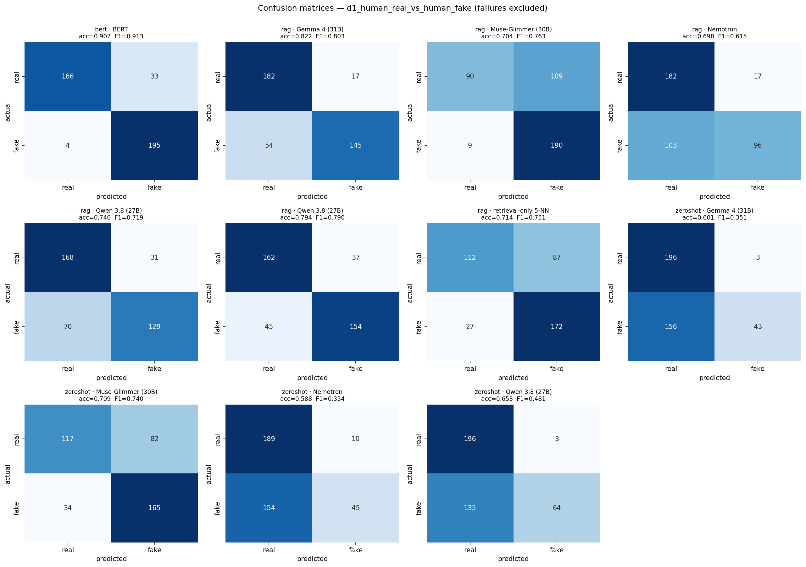

### `d2_sampled_human_real_vs_synthetic`

| modality | model | valid | accuracy | precision | recall | F1 | floor | acc−floor | fail |
|---|---|---|---|---|---|---|---|---|---|
| zeroshot | `gemma4-it-31b` | 398 | 0.6005 | 0.9167 | 0.2211 | 0.3563 | 0.500 | +0.1005 | 0.0% |
| zeroshot | `muse-glimmer-30b` | 398 | 0.6709 | 0.6518 | 0.7337 | 0.6903 | 0.500 | +0.1709 | 0.0% |
| zeroshot | `nemotron` | 398 | 0.4975 | 0.4737 | 0.0452 | 0.0826 | 0.500 | -0.0025 | 0.0% |
| zeroshot | `qwen3.8-27b` | 398 | 0.6784 | 0.9383 | 0.3819 | 0.5429 | 0.500 | +0.1784 | 0.0% |
| rag | `gemma4-it-31b` | 398 | 0.9422 | 0.9783 | 0.9045 | 0.9399 | 0.500 | +0.4422 | 0.0% |
| rag | `muse-glimmer-30b` | 398 | 0.7236 | 0.6529 | 0.9548 | 0.7755 | 0.500 | +0.2236 | 0.0% |
| rag | `nemotron` | 398 | 0.6307 | 0.8250 | 0.3317 | 0.4731 | 0.500 | +0.1307 | 0.0% |
| rag | `qwen-3.8:27b` | 398 | 0.9246 | 0.9424 | 0.9045 | 0.9231 | 0.500 | +0.4246 | 0.0% |
| rag | `qwen3.8-27b` | 398 | 0.9221 | 0.9375 | 0.9045 | 0.9207 | 0.500 | +0.4221 | 0.0% |
| rag | `retrieval-only 5-NN` | 398 | 0.9020 | 0.8846 | 0.9246 | 0.9042 | 0.500 | +0.4020 | 0.0% |
| bert | `bert` | 398 | 0.9975 | 0.9950 | 1.0000 | 0.9975 | 0.500 | +0.4975 | 0.0% |
| classical | `svm` | 398 | 0.9975 | 0.9950 | 1.0000 | 0.9975 | 0.500 | +0.4975 | 0.0% |
| classical | `xgboost` | 398 | 0.9548 | 0.9548 | 0.9548 | 0.9548 | 0.500 | +0.4548 | 0.0% |

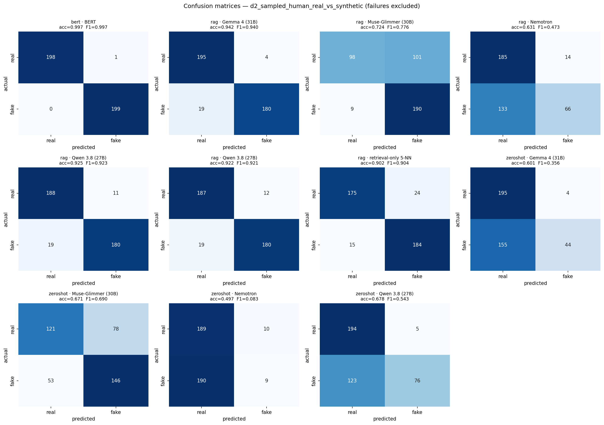

### `d2.5_sampled_human_real_vs_synthetic`

| modality | model | valid | accuracy | precision | recall | F1 | floor | acc−floor | fail |
|---|---|---|---|---|---|---|---|---|---|
| zeroshot | `gemma4-it-31b` | 398 | 0.5075 | 0.8000 | 0.0201 | 0.0392 | 0.500 | +0.0075 | 0.0% |
| zeroshot | `muse-glimmer-30b` | 398 | 0.4397 | 0.4091 | 0.2714 | 0.3263 | 0.500 | -0.0603 | 0.0% |
| zeroshot | `nemotron` | 398 | 0.4673 | 0.0000 | 0.0000 | 0.0000 | 0.500 | -0.0327 | 0.0% |
| zeroshot | `qwen3.8-27b` | 398 | 0.5226 | 0.7647 | 0.0653 | 0.1204 | 0.500 | +0.0226 | 0.0% |
| rag | `gemma4-it-31b` | 398 | 0.9623 | 0.9742 | 0.9497 | 0.9618 | 0.500 | +0.4623 | 0.0% |
| rag | `muse-glimmer-30b` | 398 | 0.7437 | 0.6678 | 0.9698 | 0.7910 | 0.500 | +0.2437 | 0.0% |
| rag | `nemotron` | 398 | 0.6106 | 0.7895 | 0.3015 | 0.4364 | 0.500 | +0.1106 | 0.0% |
| rag | `qwen-3.8:27b` | 398 | 0.9271 | 0.9250 | 0.9296 | 0.9273 | 0.500 | +0.4271 | 0.0% |
| rag | `qwen3.8-27b` | 398 | 0.9497 | 0.9366 | 0.9648 | 0.9505 | 0.500 | +0.4497 | 0.0% |
| rag | `retrieval-only 5-NN` | 398 | 0.8693 | 0.7976 | 0.9899 | 0.8834 | 0.500 | +0.3693 | 0.0% |
| bert | `bert` | 398 | 0.9975 | 0.9950 | 1.0000 | 0.9975 | 0.500 | +0.4975 | 0.0% |
| classical | `svm` | 398 | 1.0000 | 1.0000 | 1.0000 | 1.0000 | 0.500 | +0.5000 | 0.0% |
| classical | `xgboost` | 398 | 0.9698 | 0.9606 | 0.9799 | 0.9701 | 0.500 | +0.4698 | 0.0% |

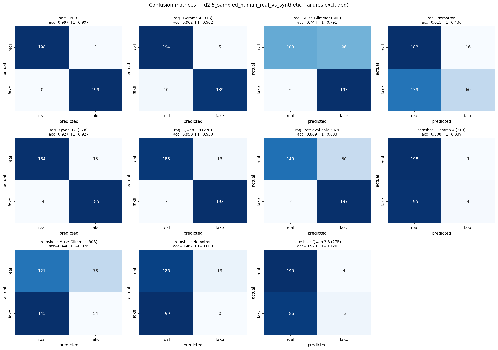

### `d3_sampled_human_real_vs_mixed`

| modality | model | valid | accuracy | precision | recall | F1 | floor | acc−floor | fail |
|---|---|---|---|---|---|---|---|---|---|
| zeroshot | `gemma4-it-31b` | 398 | 0.6106 | 0.9583 | 0.2312 | 0.3725 | 0.500 | +0.1106 | 0.0% |
| zeroshot | `muse-glimmer-30b` | 398 | 0.6935 | 0.6681 | 0.7688 | 0.7150 | 0.500 | +0.1935 | 0.0% |
| zeroshot | `nemotron` | 398 | 0.5226 | 0.6552 | 0.0955 | 0.1667 | 0.500 | +0.0226 | 0.0% |
| zeroshot | `qwen3.8-27b` | 398 | 0.6784 | 0.9494 | 0.3769 | 0.5396 | 0.500 | +0.1784 | 0.0% |
| rag | `gemma4-it-31b` | 398 | 0.8417 | 0.8736 | 0.7990 | 0.8346 | 0.500 | +0.3417 | 0.0% |
| rag | `muse-glimmer-30b` | 398 | 0.7085 | 0.6407 | 0.9497 | 0.7652 | 0.500 | +0.2085 | 0.0% |
| rag | `nemotron` | 398 | 0.6005 | 0.7439 | 0.3065 | 0.4342 | 0.500 | +0.1005 | 0.0% |
| rag | `qwen-3.8:27b` | 397 | 0.7985 | 0.8287 | 0.7538 | 0.7895 | 0.500 | +0.2985 | 0.2% |
| rag | `qwen3.8-27b` | 398 | 0.8266 | 0.8155 | 0.8442 | 0.8296 | 0.500 | +0.3266 | 0.0% |
| rag | `retrieval-only 5-NN` | 398 | 0.7085 | 0.6708 | 0.8191 | 0.7376 | 0.500 | +0.2085 | 0.0% |
| bert | `bert` | 398 | 0.9095 | 0.8791 | 0.9497 | 0.9130 | 0.500 | +0.4095 | 0.0% |
| classical | `svm` | 398 | 0.8970 | 0.8911 | 0.9045 | 0.8978 | 0.500 | +0.3970 | 0.0% |
| classical | `xgboost` | 398 | 0.8241 | 0.8564 | 0.7789 | 0.8158 | 0.500 | +0.3241 | 0.0% |

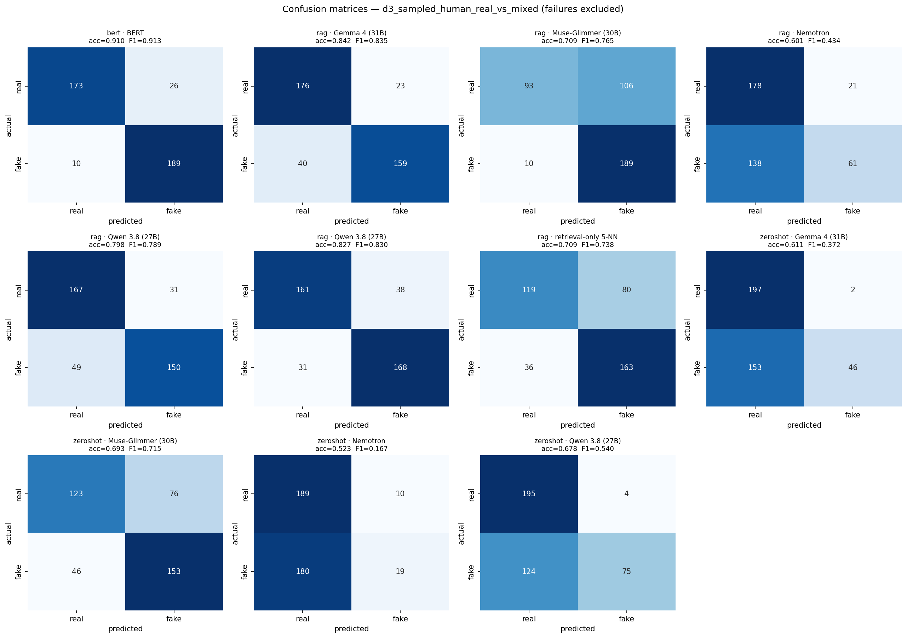

### `d3.5_sampled_human_real_vs_mixed`

| modality | model | valid | accuracy | precision | recall | F1 | floor | acc−floor | fail |
|---|---|---|---|---|---|---|---|---|---|
| zeroshot | `gemma4-it-31b` | 398 | 0.5503 | 0.8846 | 0.1156 | 0.2044 | 0.500 | +0.0503 | 0.0% |
| zeroshot | `muse-glimmer-30b` | 398 | 0.5528 | 0.5629 | 0.4724 | 0.5137 | 0.500 | +0.0528 | 0.0% |
| zeroshot | `nemotron` | 398 | 0.5226 | 0.6552 | 0.0955 | 0.1667 | 0.500 | +0.0226 | 0.0% |
| zeroshot | `qwen3.8-27b` | 398 | 0.6005 | 0.9167 | 0.2211 | 0.3563 | 0.500 | +0.1005 | 0.0% |
| rag | `gemma4-it-31b` | 398 | 0.8342 | 0.9290 | 0.7236 | 0.8136 | 0.500 | +0.3342 | 0.0% |
| rag | `muse-glimmer-30b` | 397 | 0.7028 | 0.6392 | 0.9347 | 0.7592 | 0.500 | +0.2028 | 0.2% |
| rag | `nemotron` | 398 | 0.5678 | 0.7143 | 0.2261 | 0.3435 | 0.500 | +0.0678 | 0.0% |
| rag | `qwen-3.8:27b` | 398 | 0.7990 | 0.8362 | 0.7437 | 0.7872 | 0.500 | +0.2990 | 0.0% |
| rag | `qwen3.8-27b` | 398 | 0.8317 | 0.8402 | 0.8191 | 0.8295 | 0.500 | +0.3317 | 0.0% |
| rag | `retrieval-only 5-NN` | 398 | 0.6834 | 0.6553 | 0.7739 | 0.7097 | 0.500 | +0.1834 | 0.0% |
| bert | `bert` | 398 | 0.8819 | 0.8455 | 0.9347 | 0.8878 | 0.500 | +0.3819 | 0.0% |
| classical | `svm` | 398 | 0.8995 | 0.9344 | 0.8593 | 0.8953 | 0.500 | +0.3995 | 0.0% |
| classical | `xgboost` | 398 | 0.7940 | 0.8268 | 0.7437 | 0.7831 | 0.500 | +0.2940 | 0.0% |

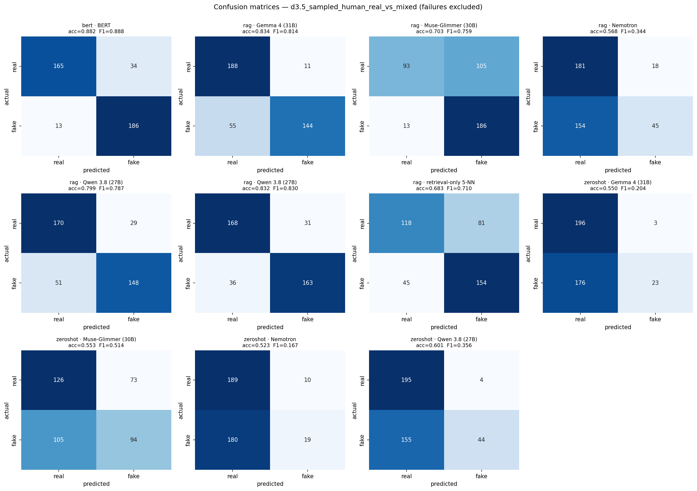

### `d3_unsampled_human_real_vs_mixed`

| modality | model | valid | accuracy | precision | recall | F1 | floor | acc−floor | fail |
|---|---|---|---|---|---|---|---|---|---|
| zeroshot | `gemma4-it-31b` | 598 | 0.5084 | 0.9817 | 0.2682 | 0.4213 | 0.667 | -0.1589 | 0.0% |
| zeroshot | `muse-glimmer-30b` | 597 | 0.7186 | 0.7919 | 0.7839 | 0.7879 | 0.667 | +0.0514 | 0.2% |
| zeroshot | `nemotron` | 598 | 0.4247 | 0.8767 | 0.1604 | 0.2712 | 0.667 | -0.2425 | 0.0% |
| zeroshot | `qwen3.8-27b` | 598 | 0.5987 | 0.9649 | 0.4135 | 0.5789 | 0.667 | -0.0686 | 0.0% |
| rag | `gemma4-it-31b` | 598 | 0.8696 | 0.9421 | 0.8571 | 0.8976 | 0.667 | +0.2023 | 0.0% |
| rag | `muse-glimmer-30b` | 598 | 0.7692 | 0.7636 | 0.9474 | 0.8456 | 0.667 | +0.1020 | 0.0% |
| rag | `nemotron` | 598 | 0.5652 | 0.9017 | 0.3910 | 0.5455 | 0.667 | -0.1020 | 0.0% |
| rag | `qwen-3.8:27b` | 598 | 0.8027 | 0.9169 | 0.7744 | 0.8397 | 0.667 | +0.1355 | 0.0% |
| rag | `qwen3.8-27b` | 598 | 0.8395 | 0.9084 | 0.8446 | 0.8753 | 0.667 | +0.1722 | 0.0% |
| rag | `retrieval-only 5-NN` | 598 | 0.7642 | 0.7654 | 0.9323 | 0.8407 | 0.667 | +0.0970 | 0.0% |
| bert | `bert` | 598 | 0.9231 | 0.9192 | 0.9699 | 0.9439 | 0.667 | +0.2559 | 0.0% |
| classical | `svm` | 598 | 0.9130 | 0.9348 | 0.9348 | 0.9348 | 0.667 | +0.2458 | 0.0% |
| classical | `xgboost` | 598 | 0.8729 | 0.8873 | 0.9273 | 0.9069 | 0.667 | +0.2057 | 0.0% |

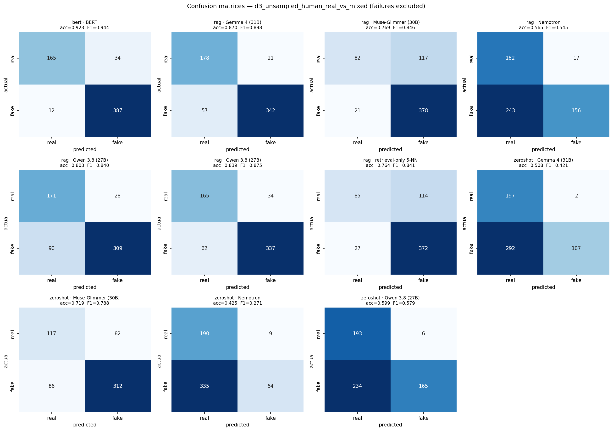

### `d2.5_unsampled_human_real_vs_synthetic`

| modality | model | valid | accuracy | precision | recall | F1 | floor | acc−floor | fail |
|---|---|---|---|---|---|---|---|---|---|
| zeroshot | `gemma4-it-31b` | 679 | 0.3034 | 0.8182 | 0.0187 | 0.0367 | 0.707 | -0.4035 | 0.0% |
| zeroshot | `muse-glimmer-30b` | 679 | 0.3991 | 0.6748 | 0.2896 | 0.4052 | 0.707 | -0.3078 | 0.0% |
| zeroshot | `nemotron` | 679 | 0.2710 | 0.0000 | 0.0000 | 0.0000 | 0.707 | -0.4359 | 0.0% |
| zeroshot | `qwen3.8-27b` | 679 | 0.3461 | 0.8600 | 0.0896 | 0.1623 | 0.707 | -0.3608 | 0.0% |
| rag | `gemma4-it-31b` | 679 | 0.9764 | 0.9854 | 0.9812 | 0.9833 | 0.707 | +0.2695 | 0.0% |
| rag | `muse-glimmer-30b` | 679 | 0.8468 | 0.8241 | 0.9958 | 0.9019 | 0.707 | +0.1399 | 0.0% |
| rag | `nemotron` | 679 | 0.4786 | 0.8580 | 0.3146 | 0.4604 | 0.707 | -0.2283 | 0.0% |
| rag | `qwen-3.8:27b` | 679 | 0.9455 | 0.9605 | 0.9625 | 0.9615 | 0.707 | +0.2386 | 0.0% |
| rag | `qwen3.8-27b` | 679 | 0.9676 | 0.9731 | 0.9812 | 0.9772 | 0.707 | +0.2607 | 0.0% |
| rag | `retrieval-only 5-NN` | 679 | 0.8689 | 0.8436 | 1.0000 | 0.9152 | 0.707 | +0.1620 | 0.0% |
| bert | `bert` | 679 | 1.0000 | 1.0000 | 1.0000 | 1.0000 | 0.707 | +0.2931 | 0.0% |
| classical | `svm` | 679 | 1.0000 | 1.0000 | 1.0000 | 1.0000 | 0.707 | +0.2931 | 0.0% |
| classical | `xgboost` | 679 | 0.9720 | 0.9695 | 0.9917 | 0.9804 | 0.707 | +0.2651 | 0.0% |

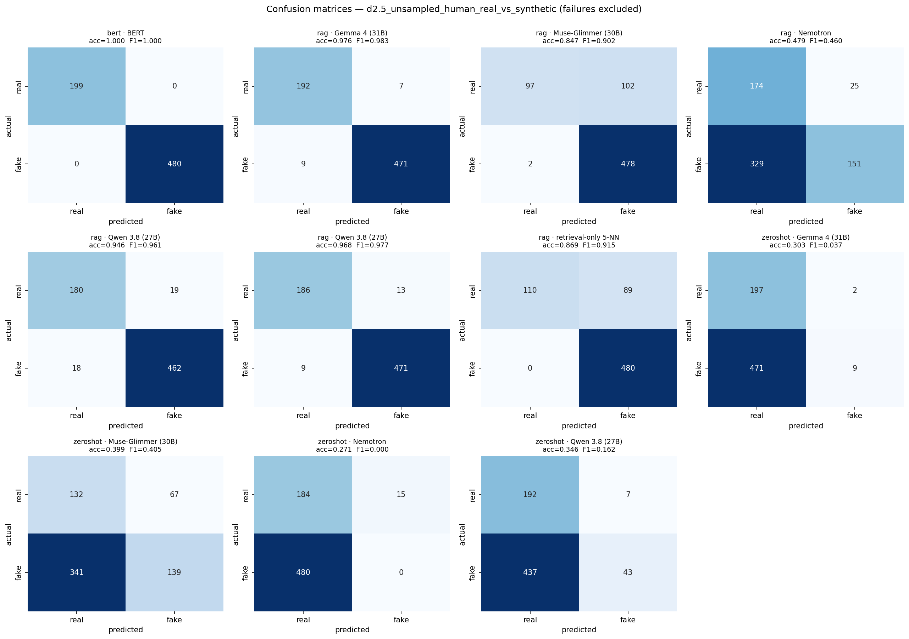

### `d3.5_unsampled_human_real_vs_mixed`

| modality | model | valid | accuracy | precision | recall | F1 | floor | acc−floor | fail |
|---|---|---|---|---|---|---|---|---|---|
| zeroshot | `gemma4-it-31b` | 878 | 0.2779 | 0.9091 | 0.0736 | 0.1362 | 0.773 | -0.4954 | 0.0% |
| zeroshot | `muse-glimmer-30b` | 878 | 0.4579 | 0.7736 | 0.4227 | 0.5467 | 0.773 | -0.3155 | 0.0% |
| zeroshot | `nemotron` | 878 | 0.2620 | 0.7925 | 0.0619 | 0.1148 | 0.773 | -0.5114 | 0.0% |
| zeroshot | `qwen3.8-27b` | 878 | 0.3474 | 0.9732 | 0.1605 | 0.2756 | 0.773 | -0.4260 | 0.0% |
| rag | `gemma4-it-31b` | 878 | 0.8941 | 0.9681 | 0.8925 | 0.9287 | 0.773 | +0.1207 | 0.0% |
| rag | `muse-glimmer-30b` | 878 | 0.8497 | 0.8547 | 0.9705 | 0.9090 | 0.773 | +0.0763 | 0.0% |
| rag | `nemotron` | 878 | 0.4601 | 0.8810 | 0.3490 | 0.5000 | 0.773 | -0.3132 | 0.0% |
| rag | `qwen-3.8:27b` | 878 | 0.8667 | 0.9532 | 0.8704 | 0.9099 | 0.773 | +0.0934 | 0.0% |
| rag | `qwen3.8-27b` | 878 | 0.8872 | 0.9448 | 0.9072 | 0.9256 | 0.773 | +0.1139 | 0.0% |
| rag | `retrieval-only 5-NN` | 878 | 0.8303 | 0.8296 | 0.9823 | 0.8995 | 0.773 | +0.0569 | 0.0% |
| bert | `bert` | 878 | 0.9431 | 0.9701 | 0.9558 | 0.9629 | 0.773 | +0.1697 | 0.0% |
| classical | `svm` | 878 | 0.9339 | 0.9712 | 0.9426 | 0.9567 | 0.773 | +0.1606 | 0.0% |
| classical | `xgboost` | 878 | 0.8975 | 0.9165 | 0.9543 | 0.9351 | 0.773 | +0.1241 | 0.0% |

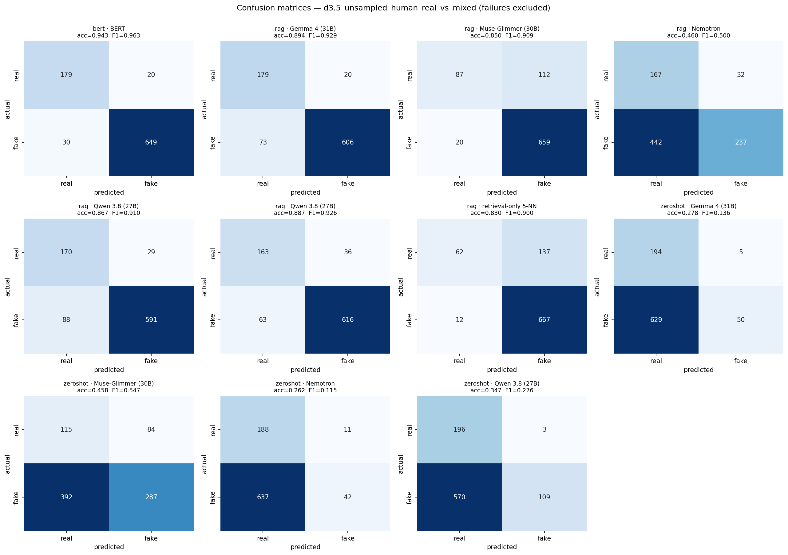

## 4. Accuracy and F1 across datasets

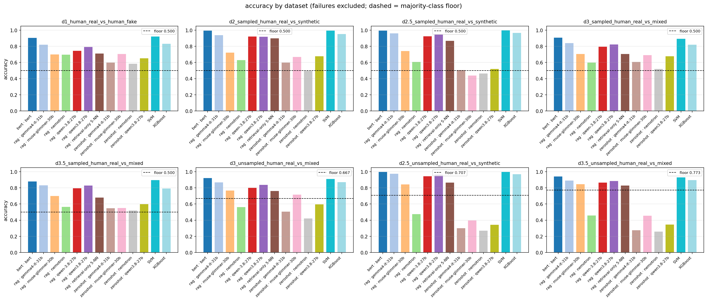

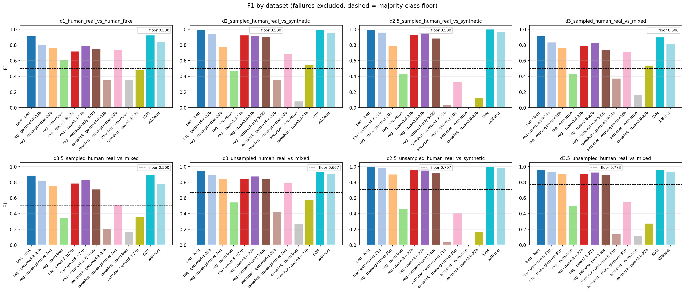

## 5. RAG vs zero-shot

The comparison the zero-shot run exists to make: same prompt, same judges, same test rows, minus the five retrieved examples.

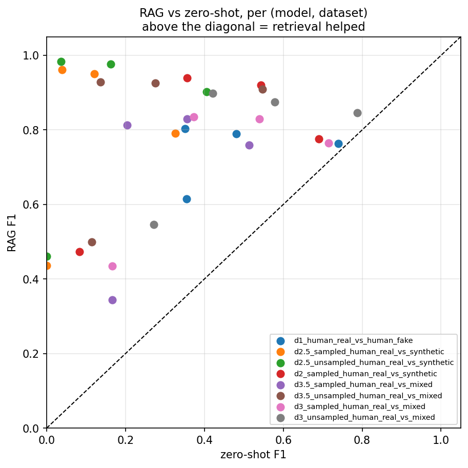

| model | datasets | mean zero-shot F1 | mean RAG F1 | mean Δ (RAG − zero-shot) | RAG wins |
|---|---|---|---|---|---|
| `gemma4-it-31b` | 8 | 0.2397 | 0.8954 | +0.6557 | 8/8 |
| `muse-glimmer-30b` | 8 | 0.5906 | 0.8138 | +0.2232 | 8/8 |
| `nemotron` | 8 | 0.1445 | 0.4760 | +0.3315 | 8/8 |
| `qwen3.8-27b` | 8 | 0.3821 | 0.8873 | +0.5051 | 8/8 |

A negative Δ on a dataset means retrieval made the judge WORSE than asking it cold -- read those against the retrieval-only baseline in section 3: when the baseline is near ceiling, RAG's number is mostly the neighbours, not the judge.

## 6. Cross-model agreement (within modality)

Computed on rows where **both** models answered: agreement is a proportion, and Cohen's kappa corrects it for chance. Low kappa with similar accuracies means the models fail on different reviews.

### zeroshot — `d1_human_real_vs_human_fake`

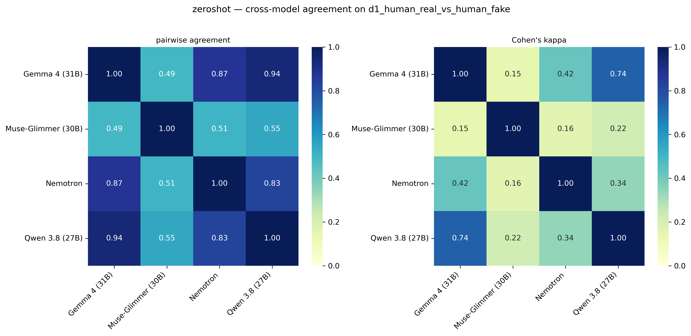

| model A | model B | agreement | Cohen's κ |
|---|---|---|---|
| Gemma 4 (31B) | Muse-Glimmer (30B) | 0.495 | 0.148 |
| Gemma 4 (31B) | Nemotron | 0.872 | 0.422 |
| Gemma 4 (31B) | Qwen 3.8 (27B) | 0.937 | 0.744 |
| Muse-Glimmer (30B) | Nemotron | 0.508 | 0.161 |
| Muse-Glimmer (30B) | Qwen 3.8 (27B) | 0.548 | 0.220 |
| Nemotron | Qwen 3.8 (27B) | 0.829 | 0.343 |

### zeroshot — `d2_sampled_human_real_vs_synthetic`

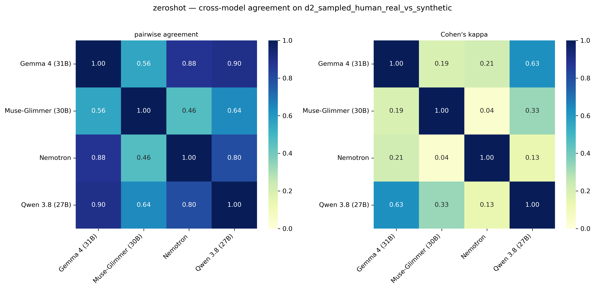

| model A | model B | agreement | Cohen's κ |
|---|---|---|---|
| Gemma 4 (31B) | Muse-Glimmer (30B) | 0.558 | 0.193 |
| Gemma 4 (31B) | Nemotron | 0.877 | 0.215 |
| Gemma 4 (31B) | Qwen 3.8 (27B) | 0.897 | 0.625 |
| Muse-Glimmer (30B) | Nemotron | 0.465 | 0.039 |
| Muse-Glimmer (30B) | Qwen 3.8 (27B) | 0.641 | 0.331 |
| Nemotron | Qwen 3.8 (27B) | 0.799 | 0.133 |

### zeroshot — `d2.5_sampled_human_real_vs_synthetic`

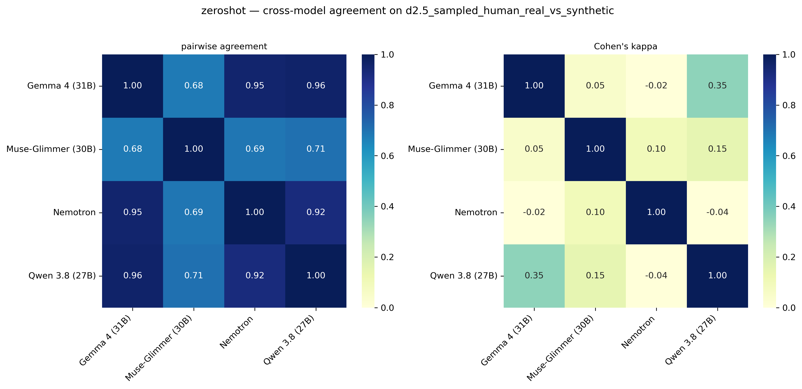

| model A | model B | agreement | Cohen's κ |
|---|---|---|---|
| Gemma 4 (31B) | Muse-Glimmer (30B) | 0.681 | 0.050 |
| Gemma 4 (31B) | Nemotron | 0.955 | -0.018 |
| Gemma 4 (31B) | Qwen 3.8 (27B) | 0.965 | 0.351 |
| Muse-Glimmer (30B) | Nemotron | 0.691 | 0.098 |
| Muse-Glimmer (30B) | Qwen 3.8 (27B) | 0.706 | 0.150 |
| Nemotron | Qwen 3.8 (27B) | 0.925 | -0.038 |

### zeroshot — `d3_sampled_human_real_vs_mixed`

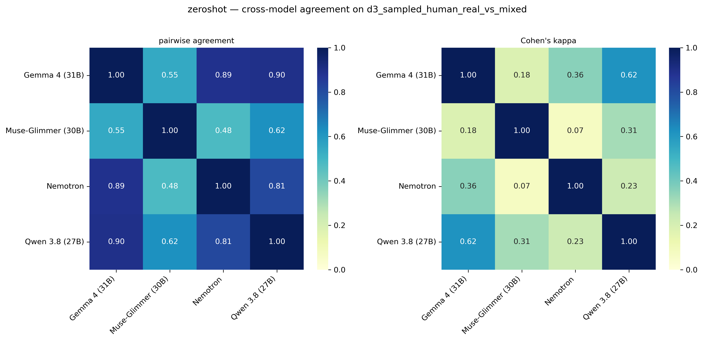

| model A | model B | agreement | Cohen's κ |
|---|---|---|---|
| Gemma 4 (31B) | Muse-Glimmer (30B) | 0.545 | 0.184 |
| Gemma 4 (31B) | Nemotron | 0.887 | 0.357 |
| Gemma 4 (31B) | Qwen 3.8 (27B) | 0.897 | 0.620 |
| Muse-Glimmer (30B) | Nemotron | 0.477 | 0.074 |
| Muse-Glimmer (30B) | Qwen 3.8 (27B) | 0.623 | 0.309 |
| Nemotron | Qwen 3.8 (27B) | 0.814 | 0.233 |

### zeroshot — `d3.5_sampled_human_real_vs_mixed`

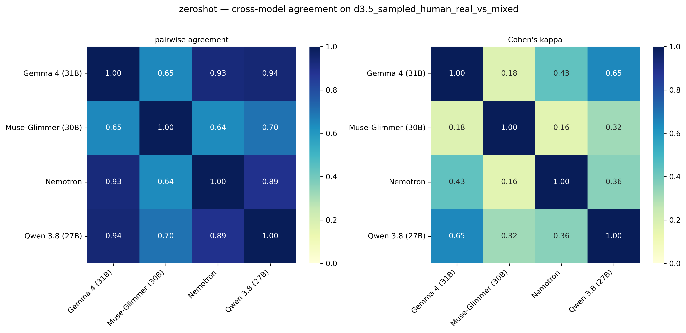

| model A | model B | agreement | Cohen's κ |
|---|---|---|---|
| Gemma 4 (31B) | Muse-Glimmer (30B) | 0.646 | 0.176 |
| Gemma 4 (31B) | Nemotron | 0.927 | 0.434 |
| Gemma 4 (31B) | Qwen 3.8 (27B) | 0.940 | 0.646 |
| Muse-Glimmer (30B) | Nemotron | 0.638 | 0.161 |
| Muse-Glimmer (30B) | Qwen 3.8 (27B) | 0.701 | 0.319 |
| Nemotron | Qwen 3.8 (27B) | 0.887 | 0.357 |

### zeroshot — `d3_unsampled_human_real_vs_mixed`

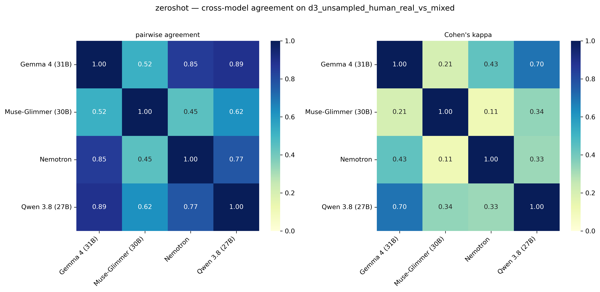

| model A | model B | agreement | Cohen's κ |
|---|---|---|---|
| Gemma 4 (31B) | Muse-Glimmer (30B) | 0.523 | 0.206 |
| Gemma 4 (31B) | Nemotron | 0.853 | 0.434 |
| Gemma 4 (31B) | Qwen 3.8 (27B) | 0.890 | 0.697 |
| Muse-Glimmer (30B) | Nemotron | 0.447 | 0.110 |
| Muse-Glimmer (30B) | Qwen 3.8 (27B) | 0.625 | 0.340 |
| Nemotron | Qwen 3.8 (27B) | 0.773 | 0.328 |

### zeroshot — `d2.5_unsampled_human_real_vs_synthetic`

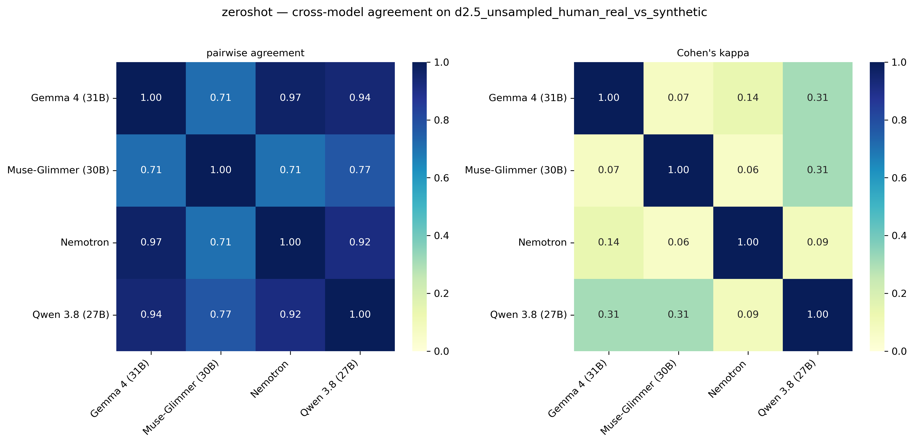

| model A | model B | agreement | Cohen's κ |
|---|---|---|---|
| Gemma 4 (31B) | Muse-Glimmer (30B) | 0.713 | 0.073 |
| Gemma 4 (31B) | Nemotron | 0.968 | 0.138 |
| Gemma 4 (31B) | Qwen 3.8 (27B) | 0.940 | 0.310 |
| Muse-Glimmer (30B) | Nemotron | 0.707 | 0.061 |
| Muse-Glimmer (30B) | Qwen 3.8 (27B) | 0.770 | 0.309 |
| Nemotron | Qwen 3.8 (27B) | 0.916 | 0.092 |

### zeroshot — `d3.5_unsampled_human_real_vs_mixed`

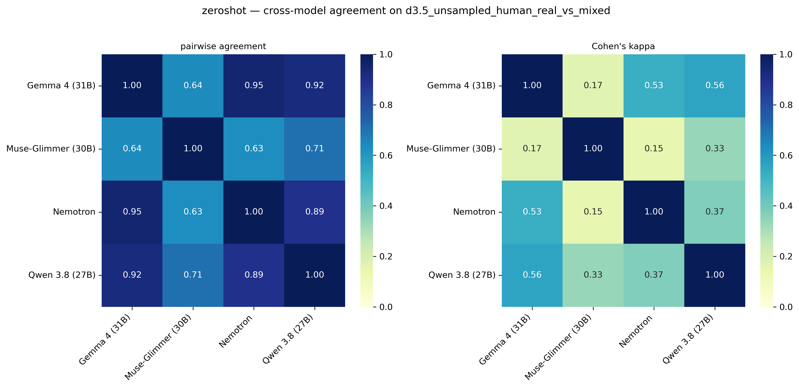

| model A | model B | agreement | Cohen's κ |
|---|---|---|---|
| Gemma 4 (31B) | Muse-Glimmer (30B) | 0.640 | 0.167 |
| Gemma 4 (31B) | Nemotron | 0.945 | 0.526 |
| Gemma 4 (31B) | Qwen 3.8 (27B) | 0.924 | 0.562 |
| Muse-Glimmer (30B) | Nemotron | 0.631 | 0.146 |
| Muse-Glimmer (30B) | Qwen 3.8 (27B) | 0.705 | 0.333 |
| Nemotron | Qwen 3.8 (27B) | 0.892 | 0.373 |

### rag — `d1_human_real_vs_human_fake`

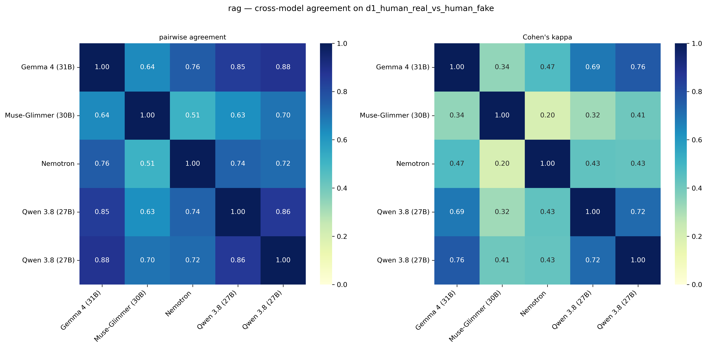

| model A | model B | agreement | Cohen's κ |
|---|---|---|---|
| Gemma 4 (31B) | Muse-Glimmer (30B) | 0.641 | 0.343 |
| Gemma 4 (31B) | Nemotron | 0.756 | 0.470 |
| Gemma 4 (31B) | Qwen 3.8 (27B) | 0.849 | 0.687 |
| Gemma 4 (31B) | Qwen 3.8 (27B) | 0.882 | 0.762 |
| Muse-Glimmer (30B) | Nemotron | 0.513 | 0.199 |
| Muse-Glimmer (30B) | Qwen 3.8 (27B) | 0.626 | 0.318 |
| Muse-Glimmer (30B) | Qwen 3.8 (27B) | 0.698 | 0.409 |
| Nemotron | Qwen 3.8 (27B) | 0.741 | 0.435 |
| Nemotron | Qwen 3.8 (27B) | 0.719 | 0.427 |
| Qwen 3.8 (27B) | Qwen 3.8 (27B) | 0.862 | 0.721 |

### rag — `d2_sampled_human_real_vs_synthetic`

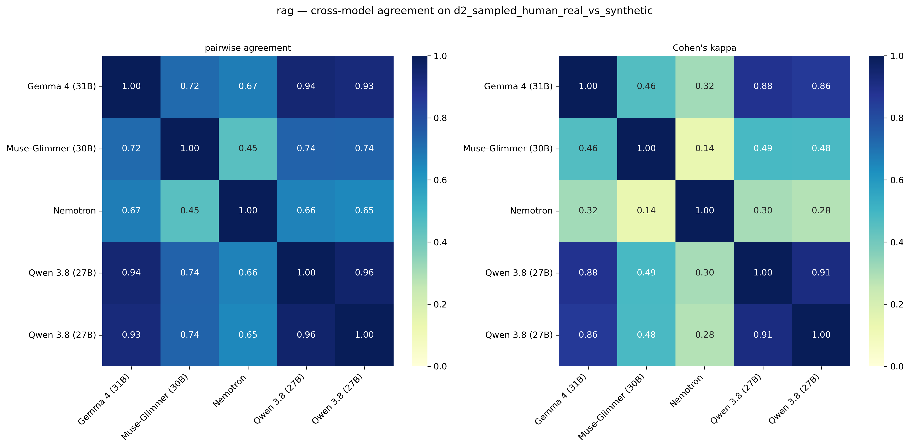

| model A | model B | agreement | Cohen's κ |
|---|---|---|---|
| Gemma 4 (31B) | Muse-Glimmer (30B) | 0.721 | 0.461 |
| Gemma 4 (31B) | Nemotron | 0.673 | 0.316 |
| Gemma 4 (31B) | Qwen 3.8 (27B) | 0.942 | 0.884 |
| Gemma 4 (31B) | Qwen 3.8 (27B) | 0.930 | 0.859 |
| Muse-Glimmer (30B) | Nemotron | 0.450 | 0.138 |
| Muse-Glimmer (30B) | Qwen 3.8 (27B) | 0.739 | 0.487 |
| Muse-Glimmer (30B) | Qwen 3.8 (27B) | 0.736 | 0.481 |
| Nemotron | Qwen 3.8 (27B) | 0.661 | 0.305 |
| Nemotron | Qwen 3.8 (27B) | 0.648 | 0.281 |
| Qwen 3.8 (27B) | Qwen 3.8 (27B) | 0.957 | 0.914 |

### rag — `d2.5_sampled_human_real_vs_synthetic`

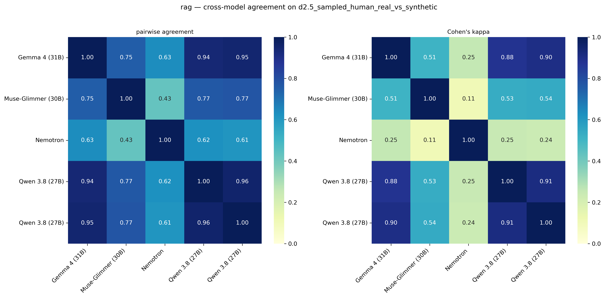

| model A | model B | agreement | Cohen's κ |
|---|---|---|---|
| Gemma 4 (31B) | Muse-Glimmer (30B) | 0.751 | 0.508 |
| Gemma 4 (31B) | Nemotron | 0.633 | 0.255 |
| Gemma 4 (31B) | Qwen 3.8 (27B) | 0.940 | 0.879 |
| Gemma 4 (31B) | Qwen 3.8 (27B) | 0.952 | 0.905 |
| Muse-Glimmer (30B) | Nemotron | 0.430 | 0.109 |
| Muse-Glimmer (30B) | Qwen 3.8 (27B) | 0.766 | 0.532 |
| Muse-Glimmer (30B) | Qwen 3.8 (27B) | 0.774 | 0.541 |
| Nemotron | Qwen 3.8 (27B) | 0.623 | 0.249 |
| Nemotron | Qwen 3.8 (27B) | 0.611 | 0.235 |
| Qwen 3.8 (27B) | Qwen 3.8 (27B) | 0.957 | 0.915 |

### rag — `d3_sampled_human_real_vs_mixed`

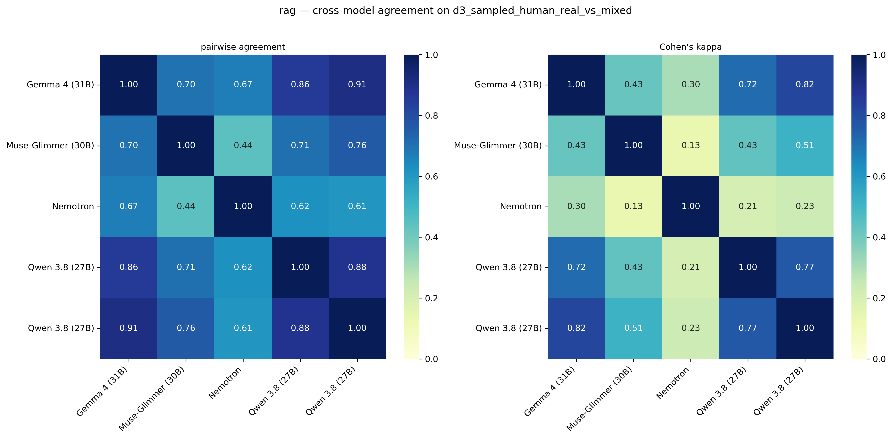

| model A | model B | agreement | Cohen's κ |
|---|---|---|---|
| Gemma 4 (31B) | Muse-Glimmer (30B) | 0.701 | 0.426 |
| Gemma 4 (31B) | Nemotron | 0.668 | 0.302 |
| Gemma 4 (31B) | Qwen 3.8 (27B) | 0.859 | 0.716 |
| Gemma 4 (31B) | Qwen 3.8 (27B) | 0.910 | 0.820 |
| Muse-Glimmer (30B) | Nemotron | 0.445 | 0.135 |
| Muse-Glimmer (30B) | Qwen 3.8 (27B) | 0.705 | 0.435 |
| Muse-Glimmer (30B) | Qwen 3.8 (27B) | 0.761 | 0.514 |
| Nemotron | Qwen 3.8 (27B) | 0.625 | 0.208 |
| Nemotron | Qwen 3.8 (27B) | 0.608 | 0.232 |
| Qwen 3.8 (27B) | Qwen 3.8 (27B) | 0.884 | 0.769 |

### rag — `d3.5_sampled_human_real_vs_mixed`

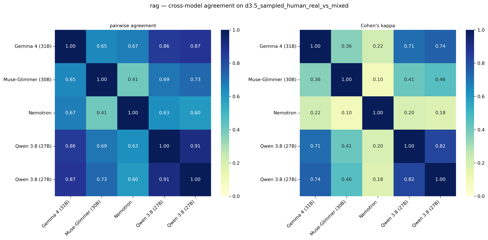

| model A | model B | agreement | Cohen's κ |
|---|---|---|---|
| Gemma 4 (31B) | Muse-Glimmer (30B) | 0.647 | 0.360 |
| Gemma 4 (31B) | Nemotron | 0.668 | 0.219 |
| Gemma 4 (31B) | Qwen 3.8 (27B) | 0.859 | 0.712 |
| Gemma 4 (31B) | Qwen 3.8 (27B) | 0.872 | 0.742 |
| Muse-Glimmer (30B) | Nemotron | 0.406 | 0.098 |
| Muse-Glimmer (30B) | Qwen 3.8 (27B) | 0.693 | 0.415 |
| Muse-Glimmer (30B) | Qwen 3.8 (27B) | 0.725 | 0.457 |
| Nemotron | Qwen 3.8 (27B) | 0.628 | 0.195 |
| Nemotron | Qwen 3.8 (27B) | 0.595 | 0.177 |
| Qwen 3.8 (27B) | Qwen 3.8 (27B) | 0.912 | 0.824 |

### rag — `d3_unsampled_human_real_vs_mixed`

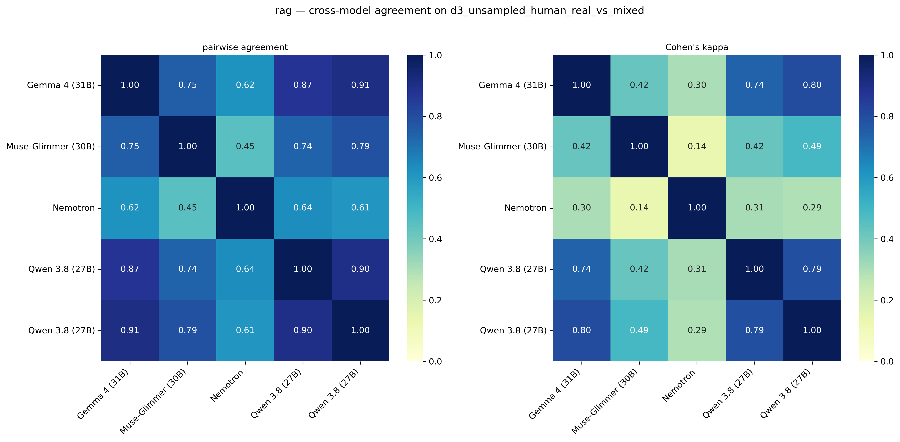

| model A | model B | agreement | Cohen's κ |
|---|---|---|---|
| Gemma 4 (31B) | Muse-Glimmer (30B) | 0.753 | 0.424 |
| Gemma 4 (31B) | Nemotron | 0.619 | 0.301 |
| Gemma 4 (31B) | Qwen 3.8 (27B) | 0.873 | 0.739 |
| Gemma 4 (31B) | Qwen 3.8 (27B) | 0.906 | 0.803 |
| Muse-Glimmer (30B) | Nemotron | 0.452 | 0.140 |
| Muse-Glimmer (30B) | Qwen 3.8 (27B) | 0.736 | 0.424 |
| Muse-Glimmer (30B) | Qwen 3.8 (27B) | 0.786 | 0.492 |
| Nemotron | Qwen 3.8 (27B) | 0.635 | 0.308 |
| Nemotron | Qwen 3.8 (27B) | 0.609 | 0.289 |
| Qwen 3.8 (27B) | Qwen 3.8 (27B) | 0.900 | 0.793 |

### rag — `d2.5_unsampled_human_real_vs_synthetic`

| model A | model B | agreement | Cohen's κ |
|---|---|---|---|
| Gemma 4 (31B) | Muse-Glimmer (30B) | 0.850 | 0.577 |
| Gemma 4 (31B) | Nemotron | 0.487 | 0.143 |
| Gemma 4 (31B) | Qwen 3.8 (27B) | 0.954 | 0.890 |
| Gemma 4 (31B) | Qwen 3.8 (27B) | 0.976 | 0.943 |
| Muse-Glimmer (30B) | Nemotron | 0.387 | 0.086 |
| Muse-Glimmer (30B) | Qwen 3.8 (27B) | 0.848 | 0.570 |
| Muse-Glimmer (30B) | Qwen 3.8 (27B) | 0.856 | 0.587 |
| Nemotron | Qwen 3.8 (27B) | 0.495 | 0.159 |
| Nemotron | Qwen 3.8 (27B) | 0.487 | 0.149 |
| Qwen 3.8 (27B) | Qwen 3.8 (27B) | 0.963 | 0.910 |

### rag — `d3.5_unsampled_human_real_vs_mixed`

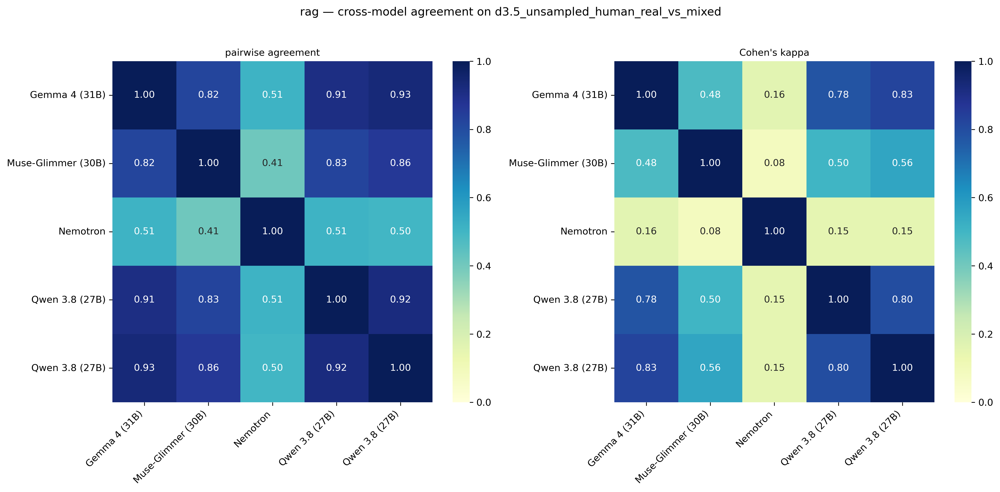

| model A | model B | agreement | Cohen's κ |
|---|---|---|---|
| Gemma 4 (31B) | Muse-Glimmer (30B) | 0.823 | 0.479 |
| Gemma 4 (31B) | Nemotron | 0.511 | 0.161 |
| Gemma 4 (31B) | Qwen 3.8 (27B) | 0.909 | 0.779 |
| Gemma 4 (31B) | Qwen 3.8 (27B) | 0.932 | 0.828 |
| Muse-Glimmer (30B) | Nemotron | 0.408 | 0.084 |
| Muse-Glimmer (30B) | Qwen 3.8 (27B) | 0.828 | 0.500 |
| Muse-Glimmer (30B) | Qwen 3.8 (27B) | 0.860 | 0.557 |
| Nemotron | Qwen 3.8 (27B) | 0.509 | 0.153 |
| Nemotron | Qwen 3.8 (27B) | 0.498 | 0.154 |
| Qwen 3.8 (27B) | Qwen 3.8 (27B) | 0.920 | 0.801 |

## 7. Classical baselines

| model | dataset | accuracy | precision | recall | F1 | floor | acc−floor |
|---|---|---|---|---|---|---|---|
| `svm` | `d1_human_real_vs_human_fake` | 0.9246 | 0.9246 | 0.9246 | 0.9246 | 0.500 | +0.4246 |
| `svm` | `d2.5_sampled_human_real_vs_synthetic` | 1.0000 | 1.0000 | 1.0000 | 1.0000 | 0.500 | +0.5000 |
| `svm` | `d2.5_unsampled_human_real_vs_synthetic` | 1.0000 | 1.0000 | 1.0000 | 1.0000 | 0.707 | +0.2931 |
| `svm` | `d2_sampled_human_real_vs_synthetic` | 0.9975 | 0.9950 | 1.0000 | 0.9975 | 0.500 | +0.4975 |
| `svm` | `d3.5_sampled_human_real_vs_mixed` | 0.8995 | 0.9344 | 0.8593 | 0.8953 | 0.500 | +0.3995 |
| `svm` | `d3.5_unsampled_human_real_vs_mixed` | 0.9339 | 0.9712 | 0.9426 | 0.9567 | 0.773 | +0.1606 |
| `svm` | `d3_sampled_human_real_vs_mixed` | 0.8970 | 0.8911 | 0.9045 | 0.8978 | 0.500 | +0.3970 |
| `svm` | `d3_unsampled_human_real_vs_mixed` | 0.9130 | 0.9348 | 0.9348 | 0.9348 | 0.667 | +0.2458 |
| `xgboost` | `d1_human_real_vs_human_fake` | 0.8342 | 0.8213 | 0.8543 | 0.8374 | 0.500 | +0.3342 |
| `xgboost` | `d2.5_sampled_human_real_vs_synthetic` | 0.9698 | 0.9606 | 0.9799 | 0.9701 | 0.500 | +0.4698 |
| `xgboost` | `d2.5_unsampled_human_real_vs_synthetic` | 0.9720 | 0.9695 | 0.9917 | 0.9804 | 0.707 | +0.2651 |
| `xgboost` | `d2_sampled_human_real_vs_synthetic` | 0.9548 | 0.9548 | 0.9548 | 0.9548 | 0.500 | +0.4548 |
| `xgboost` | `d3.5_sampled_human_real_vs_mixed` | 0.7940 | 0.8268 | 0.7437 | 0.7831 | 0.500 | +0.2940 |
| `xgboost` | `d3.5_unsampled_human_real_vs_mixed` | 0.8975 | 0.9165 | 0.9543 | 0.9351 | 0.773 | +0.1241 |
| `xgboost` | `d3_sampled_human_real_vs_mixed` | 0.8241 | 0.8564 | 0.7789 | 0.8158 | 0.500 | +0.3241 |
| `xgboost` | `d3_unsampled_human_real_vs_mixed` | 0.8729 | 0.8873 | 0.9273 | 0.9069 | 0.667 | +0.2057 |

## 8. Key findings

- **Best single (modality, model, dataset) cell by F1**: `bert/bert` on `d2.5_unsampled_human_real_vs_synthetic` (F1 1.0000, accuracy 1.0000 against a floor of 0.707).

- **zeroshot**: best judge by mean F1 across datasets is `muse-glimmer-30b` (F1 0.5906, accuracy 0.5801).

- **rag**: best judge by mean F1 across datasets is `gemma4-it-31b` (F1 0.8954, accuracy 0.8928).

- **bert**: best model by mean F1 across datasets is `bert` (F1 0.9520, accuracy 0.9449).

- **Retrieval-only baseline vs the judges**: the LLM judge beats the k-NN baseline in 27 of 40 (model, dataset) cells. Where it does not, the RAG number is a nearest-neighbour result, not evidence of judgement.

- **Retrieval's contribution**: mean Δ F1 (RAG − zero-shot) is +0.4289 over 32 cells, with retrieval helping in 32.

- **Failures**: highest failure rate is `rag/qwen-3.8:27b` on `d3_sampled_human_real_vs_mixed` (1 of 398, 0.2%). Those rows are excluded from every metric above.

- **Agreement**: highest pairwise κ is 0.943 (Gemma 4 (31B) vs Qwen 3.8 (27B)), lowest is -0.038 (Nemotron vs Qwen 3.8 (27B)).

- **Against the floor**: 17 of 104 rows score BELOW their dataset's majority-class floor -- on those, the constant predictor is the better classifier: `rag/nemotron` on `d2.5_unsampled_human_real_vs_synthetic`, `rag/nemotron` on `d3.5_unsampled_human_real_vs_mixed`, `rag/nemotron` on `d3_unsampled_human_real_vs_mixed`, `zeroshot/gemma4-it-31b` on `d2.5_unsampled_human_real_vs_synthetic`, `zeroshot/gemma4-it-31b` on `d3.5_unsampled_human_real_vs_mixed`, `zeroshot/gemma4-it-31b` on `d3_unsampled_human_real_vs_mixed`, `zeroshot/muse-glimmer-30b` on `d2.5_sampled_human_real_vs_synthetic`, `zeroshot/muse-glimmer-30b` on `d2.5_unsampled_human_real_vs_synthetic`, `zeroshot/muse-glimmer-30b` on `d3.5_unsampled_human_real_vs_mixed`, `zeroshot/nemotron` on `d2.5_sampled_human_real_vs_synthetic`, `zeroshot/nemotron` on `d2.5_unsampled_human_real_vs_synthetic`, `zeroshot/nemotron` on `d2_sampled_human_real_vs_synthetic`, `zeroshot/nemotron` on `d3.5_unsampled_human_real_vs_mixed`, `zeroshot/nemotron` on `d3_unsampled_human_real_vs_mixed`, `zeroshot/qwen3.8-27b` on `d2.5_unsampled_human_real_vs_synthetic`, `zeroshot/qwen3.8-27b` on `d3.5_unsampled_human_real_vs_mixed`, `zeroshot/qwen3.8-27b` on `d3_unsampled_human_real_vs_mixed`.

## 9. Appendix: accuracy by origin

Per-origin accuracy on the test split. A synthetic column is one generating model's own reviews -- a judge scoring high on a column it wrote itself is the self-recognition confound, not detection ability. Columns are the union of origins present in that dataset's runs (`—` = that model's file has no rows for the origin, e.g. BERT, which carries no `origin` column).

### `d1_human_real_vs_human_fake`

| modality | model | `human_fake` | `human_real` |
|---|---|---|---|
| bert | `bert` | — | — |
| rag | `gemma4-it-31b` | 0.729 (n=199) | 0.915 (n=199) |
| rag | `muse-glimmer-30b` | 0.955 (n=199) | 0.452 (n=199) |
| rag | `nemotron` | 0.482 (n=199) | 0.915 (n=199) |
| rag | `qwen-3.8:27b` | 0.648 (n=199) | 0.844 (n=199) |
| rag | `qwen3.8-27b` | 0.774 (n=199) | 0.814 (n=199) |
| zeroshot | `gemma4-it-31b` | 0.216 (n=199) | 0.985 (n=199) |
| zeroshot | `muse-glimmer-30b` | 0.829 (n=199) | 0.588 (n=199) |
| zeroshot | `nemotron` | 0.226 (n=199) | 0.950 (n=199) |
| zeroshot | `qwen3.8-27b` | 0.322 (n=199) | 0.985 (n=199) |

### `d2_sampled_human_real_vs_synthetic`

| modality | model | `doomgrave/ministral-3:8b` | `gemma4:e4b` | `human_real` | `llama3.2:3b` | `qwen3.5:9b` |
|---|---|---|---|---|---|---|
| bert | `bert` | — | — | — | — | — |
| rag | `gemma4-it-31b` | 0.880 (n=50) | 0.939 (n=49) | 0.980 (n=199) | 0.800 (n=50) | 1.000 (n=50) |
| rag | `muse-glimmer-30b` | 0.960 (n=50) | 0.959 (n=49) | 0.492 (n=199) | 0.900 (n=50) | 1.000 (n=50) |
| rag | `nemotron` | 0.220 (n=50) | 0.449 (n=49) | 0.930 (n=199) | 0.200 (n=50) | 0.460 (n=50) |
| rag | `qwen-3.8:27b` | 0.880 (n=50) | 0.959 (n=49) | 0.945 (n=199) | 0.780 (n=50) | 1.000 (n=50) |
| rag | `qwen3.8-27b` | 0.920 (n=50) | 0.959 (n=49) | 0.940 (n=199) | 0.740 (n=50) | 1.000 (n=50) |
| zeroshot | `gemma4-it-31b` | 0.080 (n=50) | 0.286 (n=49) | 0.980 (n=199) | 0.280 (n=50) | 0.240 (n=50) |
| zeroshot | `muse-glimmer-30b` | 0.680 (n=50) | 0.776 (n=49) | 0.608 (n=199) | 0.660 (n=50) | 0.820 (n=50) |
| zeroshot | `nemotron` | 0.000 (n=50) | 0.061 (n=49) | 0.950 (n=199) | 0.000 (n=50) | 0.120 (n=50) |
| zeroshot | `qwen3.8-27b` | 0.300 (n=50) | 0.449 (n=49) | 0.975 (n=199) | 0.420 (n=50) | 0.360 (n=50) |

### `d2.5_sampled_human_real_vs_synthetic`

| modality | model | `deepseekv4-flash` | `glm-5.3-flash` | `gpt5.6-luna` | `gpt5.6-terra` | `human_real` |
|---|---|---|---|---|---|---|
| bert | `bert` | — | — | — | — | — |
| rag | `gemma4-it-31b` | 0.940 (n=50) | 0.878 (n=49) | 0.980 (n=50) | 1.000 (n=50) | 0.975 (n=199) |
| rag | `muse-glimmer-30b` | 0.960 (n=50) | 0.959 (n=49) | 0.960 (n=50) | 1.000 (n=50) | 0.518 (n=199) |
| rag | `nemotron` | 0.320 (n=50) | 0.306 (n=49) | 0.260 (n=50) | 0.320 (n=50) | 0.920 (n=199) |
| rag | `qwen-3.8:27b` | 0.960 (n=50) | 0.796 (n=49) | 0.960 (n=50) | 1.000 (n=50) | 0.925 (n=199) |
| rag | `qwen3.8-27b` | 0.980 (n=50) | 0.898 (n=49) | 0.980 (n=50) | 1.000 (n=50) | 0.935 (n=199) |
| zeroshot | `gemma4-it-31b` | 0.060 (n=50) | 0.000 (n=49) | 0.020 (n=50) | 0.000 (n=50) | 0.995 (n=199) |
| zeroshot | `muse-glimmer-30b` | 0.340 (n=50) | 0.122 (n=49) | 0.340 (n=50) | 0.280 (n=50) | 0.608 (n=199) |
| zeroshot | `nemotron` | 0.000 (n=50) | 0.000 (n=49) | 0.000 (n=50) | 0.000 (n=50) | 0.935 (n=199) |
| zeroshot | `qwen3.8-27b` | 0.100 (n=50) | 0.020 (n=49) | 0.100 (n=50) | 0.040 (n=50) | 0.980 (n=199) |

### `d3_sampled_human_real_vs_mixed`

| modality | model | `doomgrave/ministral-3:8b` | `gemma4:e4b` | `human_fake` | `human_real` | `llama3.2:3b` | `qwen3.5:9b` |
|---|---|---|---|---|---|---|---|
| bert | `bert` | — | — | — | — | — | — |
| rag | `gemma4-it-31b` | 0.840 (n=25) | 0.960 (n=25) | 0.677 (n=99) | 0.884 (n=199) | 0.920 (n=25) | 0.960 (n=25) |
| rag | `muse-glimmer-30b` | 0.920 (n=25) | 1.000 (n=25) | 0.929 (n=99) | 0.467 (n=199) | 1.000 (n=25) | 0.960 (n=25) |
| rag | `nemotron` | 0.200 (n=25) | 0.280 (n=25) | 0.343 (n=99) | 0.894 (n=199) | 0.280 (n=25) | 0.320 (n=25) |
| rag | `qwen-3.8:27b` | 0.760 (n=25) | 0.960 (n=25) | 0.636 (n=99) | 0.843 (n=199) | 0.840 (n=25) | 0.920 (n=25) |
| rag | `qwen3.8-27b` | 0.880 (n=25) | 0.960 (n=25) | 0.747 (n=99) | 0.809 (n=199) | 0.960 (n=25) | 0.960 (n=25) |
| zeroshot | `gemma4-it-31b` | 0.160 (n=25) | 0.320 (n=25) | 0.222 (n=99) | 0.990 (n=199) | 0.240 (n=25) | 0.240 (n=25) |
| zeroshot | `muse-glimmer-30b` | 0.440 (n=25) | 0.920 (n=25) | 0.768 (n=99) | 0.618 (n=199) | 0.800 (n=25) | 0.920 (n=25) |
| zeroshot | `nemotron` | 0.000 (n=25) | 0.000 (n=25) | 0.182 (n=99) | 0.950 (n=199) | 0.040 (n=25) | 0.000 (n=25) |
| zeroshot | `qwen3.8-27b` | 0.280 (n=25) | 0.520 (n=25) | 0.333 (n=99) | 0.980 (n=199) | 0.480 (n=25) | 0.400 (n=25) |

### `d3.5_sampled_human_real_vs_mixed`

| modality | model | `deepseekv4-flash` | `glm-5.3-flash` | `gpt5.6-luna` | `gpt5.6-terra` | `human_fake` | `human_real` |
|---|---|---|---|---|---|---|---|
| bert | `bert` | — | — | — | — | — | — |
| rag | `gemma4-it-31b` | 0.840 (n=25) | 0.800 (n=25) | 0.960 (n=25) | 0.960 (n=25) | 0.556 (n=99) | 0.945 (n=199) |
| rag | `muse-glimmer-30b` | 1.000 (n=25) | 0.960 (n=25) | 0.920 (n=25) | 1.000 (n=25) | 0.899 (n=99) | 0.470 (n=199) |
| rag | `nemotron` | 0.240 (n=25) | 0.120 (n=25) | 0.160 (n=25) | 0.160 (n=25) | 0.283 (n=99) | 0.910 (n=199) |
| rag | `qwen-3.8:27b` | 0.920 (n=25) | 0.840 (n=25) | 0.920 (n=25) | 0.920 (n=25) | 0.586 (n=99) | 0.854 (n=199) |
| rag | `qwen3.8-27b` | 0.960 (n=25) | 0.960 (n=25) | 0.960 (n=25) | 0.920 (n=25) | 0.687 (n=99) | 0.844 (n=199) |
| zeroshot | `gemma4-it-31b` | 0.000 (n=25) | 0.000 (n=25) | 0.040 (n=25) | 0.000 (n=25) | 0.222 (n=99) | 0.985 (n=199) |
| zeroshot | `muse-glimmer-30b` | 0.240 (n=25) | 0.120 (n=25) | 0.240 (n=25) | 0.240 (n=25) | 0.737 (n=99) | 0.633 (n=199) |
| zeroshot | `nemotron` | 0.040 (n=25) | 0.000 (n=25) | 0.000 (n=25) | 0.000 (n=25) | 0.182 (n=99) | 0.950 (n=199) |
| zeroshot | `qwen3.8-27b` | 0.160 (n=25) | 0.000 (n=25) | 0.080 (n=25) | 0.040 (n=25) | 0.374 (n=99) | 0.980 (n=199) |

### `d3_unsampled_human_real_vs_mixed`

| modality | model | `doomgrave/ministral-3:8b` | `gemma4:e4b` | `human_fake` | `human_real` | `llama3.2:3b` | `qwen3.5:9b` |
|---|---|---|---|---|---|---|---|
| bert | `bert` | — | — | — | — | — | — |
| rag | `gemma4-it-31b` | 0.900 (n=50) | 1.000 (n=50) | 0.764 (n=199) | 0.894 (n=199) | 0.940 (n=50) | 0.960 (n=50) |
| rag | `muse-glimmer-30b` | 0.960 (n=50) | 1.000 (n=50) | 0.930 (n=199) | 0.412 (n=199) | 0.900 (n=50) | 1.000 (n=50) |
| rag | `nemotron` | 0.180 (n=50) | 0.440 (n=50) | 0.447 (n=199) | 0.915 (n=199) | 0.220 (n=50) | 0.500 (n=50) |
| rag | `qwen-3.8:27b` | 0.760 (n=50) | 0.980 (n=50) | 0.658 (n=199) | 0.859 (n=199) | 0.840 (n=50) | 0.980 (n=50) |
| rag | `qwen3.8-27b` | 0.900 (n=50) | 0.980 (n=50) | 0.754 (n=199) | 0.829 (n=199) | 0.860 (n=50) | 1.000 (n=50) |
| zeroshot | `gemma4-it-31b` | 0.180 (n=50) | 0.300 (n=50) | 0.276 (n=199) | 0.990 (n=199) | 0.260 (n=50) | 0.300 (n=50) |
| zeroshot | `muse-glimmer-30b` | 0.680 (n=50) | 0.800 (n=50) | 0.793 (n=199) | 0.588 (n=199) | 0.720 (n=50) | 0.900 (n=50) |
| zeroshot | `nemotron` | 0.020 (n=50) | 0.060 (n=50) | 0.271 (n=199) | 0.955 (n=199) | 0.000 (n=50) | 0.120 (n=50) |
| zeroshot | `qwen3.8-27b` | 0.320 (n=50) | 0.480 (n=50) | 0.402 (n=199) | 0.970 (n=199) | 0.440 (n=50) | 0.460 (n=50) |

### `d2.5_unsampled_human_real_vs_synthetic`

| modality | model | `deepseekv4-flash` | `glm-5.3-flash` | `gpt5.6-luna` | `gpt5.6-terra` | `human_real` |
|---|---|---|---|---|---|---|
| bert | `bert` | — | — | — | — | — |
| rag | `gemma4-it-31b` | 0.985 (n=200) | 0.938 (n=80) | 0.990 (n=100) | 1.000 (n=100) | 0.965 (n=199) |
| rag | `muse-glimmer-30b` | 0.995 (n=200) | 0.988 (n=80) | 1.000 (n=100) | 1.000 (n=100) | 0.487 (n=199) |
| rag | `nemotron` | 0.290 (n=200) | 0.275 (n=80) | 0.350 (n=100) | 0.360 (n=100) | 0.874 (n=199) |
| rag | `qwen-3.8:27b` | 0.970 (n=200) | 0.887 (n=80) | 0.990 (n=100) | 0.980 (n=100) | 0.905 (n=199) |
| rag | `qwen3.8-27b` | 0.985 (n=200) | 0.950 (n=80) | 0.990 (n=100) | 0.990 (n=100) | 0.935 (n=199) |
| zeroshot | `gemma4-it-31b` | 0.025 (n=200) | 0.013 (n=80) | 0.020 (n=100) | 0.010 (n=100) | 0.990 (n=199) |
| zeroshot | `muse-glimmer-30b` | 0.305 (n=200) | 0.138 (n=80) | 0.390 (n=100) | 0.280 (n=100) | 0.663 (n=199) |
| zeroshot | `nemotron` | 0.000 (n=200) | 0.000 (n=80) | 0.000 (n=100) | 0.000 (n=100) | 0.925 (n=199) |
| zeroshot | `qwen3.8-27b` | 0.115 (n=200) | 0.025 (n=80) | 0.110 (n=100) | 0.070 (n=100) | 0.965 (n=199) |

### `d3.5_unsampled_human_real_vs_mixed`

| modality | model | `deepseekv4-flash` | `glm-5.3-flash` | `gpt5.6-luna` | `gpt5.6-terra` | `human_fake` | `human_real` |
|---|---|---|---|---|---|---|---|
| bert | `bert` | — | — | — | — | — | — |
| rag | `gemma4-it-31b` | 0.980 (n=200) | 0.925 (n=80) | 0.990 (n=100) | 1.000 (n=100) | 0.688 (n=199) | 0.899 (n=199) |
| rag | `muse-glimmer-30b` | 0.995 (n=200) | 0.975 (n=80) | 1.000 (n=100) | 1.000 (n=100) | 0.915 (n=199) | 0.437 (n=199) |
| rag | `nemotron` | 0.285 (n=200) | 0.263 (n=80) | 0.400 (n=100) | 0.350 (n=100) | 0.422 (n=199) | 0.839 (n=199) |
| rag | `qwen-3.8:27b` | 0.965 (n=200) | 0.900 (n=80) | 0.990 (n=100) | 0.980 (n=100) | 0.648 (n=199) | 0.854 (n=199) |
| rag | `qwen3.8-27b` | 0.985 (n=200) | 0.950 (n=80) | 0.990 (n=100) | 0.990 (n=100) | 0.729 (n=199) | 0.819 (n=199) |
| zeroshot | `gemma4-it-31b` | 0.030 (n=200) | 0.013 (n=80) | 0.020 (n=100) | 0.010 (n=100) | 0.201 (n=199) | 0.975 (n=199) |
| zeroshot | `muse-glimmer-30b` | 0.295 (n=200) | 0.163 (n=80) | 0.430 (n=100) | 0.270 (n=100) | 0.729 (n=199) | 0.578 (n=199) |
| zeroshot | `nemotron` | 0.000 (n=200) | 0.000 (n=80) | 0.000 (n=100) | 0.000 (n=100) | 0.211 (n=199) | 0.945 (n=199) |
| zeroshot | `qwen3.8-27b` | 0.120 (n=200) | 0.025 (n=80) | 0.120 (n=100) | 0.070 (n=100) | 0.322 (n=199) | 0.985 (n=199) |

---
_Generated by `src/analyze_results.py`; inputs are the per-row prediction CSVs and the classical trainers' final_test_results.json._
